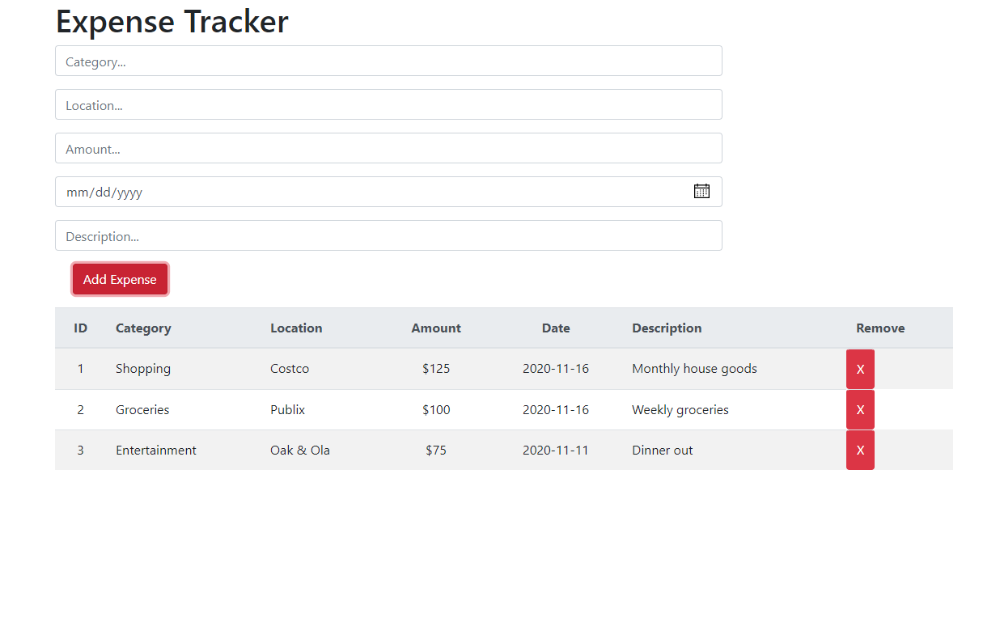

# React Expense Tracking App

*A simple expense tracking app written in JavaScript, HTML, React, and Bootstrap*

Use it [here](https://kendric-react-expense-tracker.herokuapp.com/)

## Summary
A simple expense tracking app that allows you to add expenses, tracking the category of the expense, the location, amount, date, and a description.

The app will also pre-populate drop-down options for category and location based on data already entered, making it easy to record multiple epenses from the same location.

This was my first project utilizing React and Bootstrap. Once I understood how to work with State and how to pass Props between components, it became clear how useful React could be.  Bootstrap is also a huge time saver and eliminates having to come up with a look and feel on your own.

## Author
- **Graham Smith** - Full-Stack Software Developer

